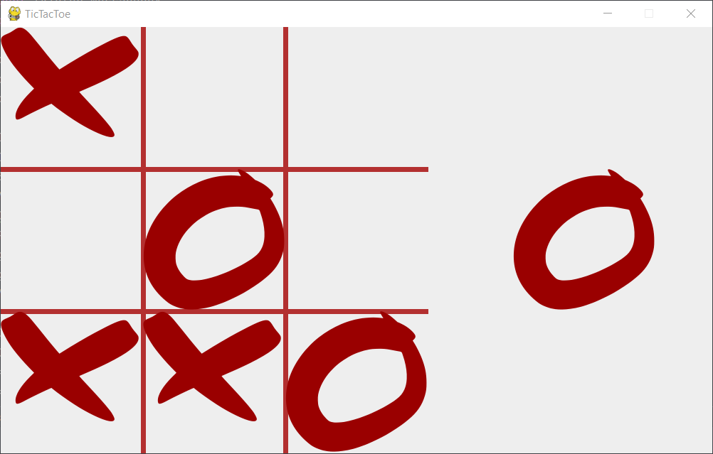

## Tic Tac Toe
> A classic puzzle game.

## Table of Contents
* [General Info](#general-information)
* [Technologies Used](#technologies-used)
* [Features](#features)
* [Screenshots](#screenshots)
* [Project Status](#project-status)
* [Room for Improvement](#room-for-improvement)

## General Information
- Attempt making Tic Tac Toe using Pygame library

## Technologies Used
- Python
- PyGame
- Tkinter
- Pyautogui

## Features
- Large graphics
- Popups with a 'win' or 'draw'

## Screenshots

## Project Status
Project is: _in progress_

## Room for Improvement
- High score

